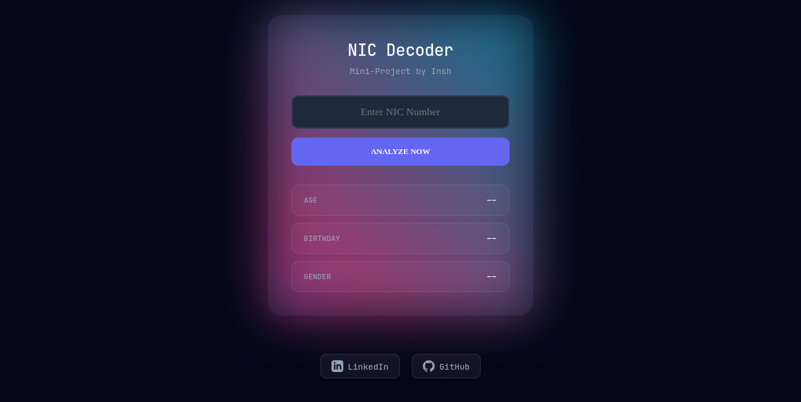

# 🪪 NIC Decoder

A sleek, modern, and high-performance web-based utility to extract information from Sri Lankan National Identity Card (NIC) numbers. This tool supports both the **old (10-digit)** and **new (12-digit)** NIC formats.

## ✨ Features

- **Dual Format Support:** Seamlessly decodes both legacy 10-digit (e.g., 901234567V) and modern 12-digit (e.g., 199012345678) NICs.
- **Instant Extraction:** Get the **Birth Year**, **Exact Birthday**, and **Gender** in real-time.
- **Automatic Age Calculation:** Dynamically calculates the holder's age based on the current year.
- **Cyberpunk Aesthetic:** Features a high-end "Dark Edition" UI with CSS glassmorphism, neon glow effects, and smooth animations.
- **Fully Responsive:** Optimized for desktop, tablets, and mobile devices.

---

## 🚀 Live Demo

Check out the live application here: **[link](https://inshronin.github.io/NIC-Decoder/)**



---

## 🛠️ Built With

- **HTML5:** Semantic structure.
- **CSS3:** Custom properties (variables), Flexbox, and advanced keyframe animations for the glow effect.
- **JavaScript (ES6):** Logic for NIC parsing, date calculation, and DOM manipulation.

---

## 📖 How It Works

The Sri Lankan NIC number contains encoded information about the holder's birth date and gender:

1. **Year:** Extracted from the first 2 (Old) or 4 (New) digits.
2. **Gender:** If the day-of-year value is greater than 500, the holder is Female (and 500 is subtracted to find the day).
3. **Birthday:** The remaining value represents the day of the year, which the script maps to the corresponding month and day.

---

## 📥 Installation & Setup

1. **Clone the repository:**

```bash
git clone https://github.com/InshRonin/NIC-Decoder.git

```

2. **Navigate to the folder:**

```bash
cd NIC-Decoder

```

3. **Open the project:**
   Simply double-click `index.html` to run it in your preferred browser.

---

## 🎨 UI Preview

| Feature           | Description                                                            |
| ----------------- | ---------------------------------------------------------------------- |
| **Glow Effect**   | An animated linear-gradient border that shifts over time.              |
| **Gender Tags**   | Dynamic color coding (Cyan for Male, Pink for Female).                 |
| **Glassmorphism** | Semi-transparent backgrounds with backdrop filters for a premium feel. |

---

## 👤 Author

**Mohamed Inshaf (Insh)**

- LinkedIn: [@mohamed-inshaf](https://www.linkedin.com/in/mohamed-inshaf-150180364/)
- GitHub: [@InshRonin](https://github.com/InshRonin)

---

## 📜 License

This project is open-source and available under the [MIT License](https://www.google.com/search?q=LICENSE).
